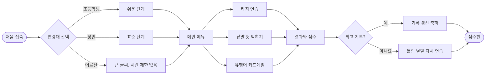
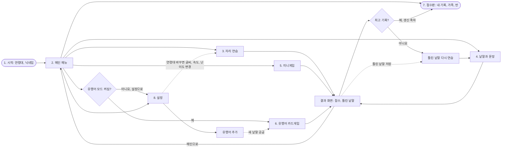

# 03. 화면과 흐름

## 화면 목록

| 번호 | 화면 | 주요 내용 |
|---|---|---|
| 1 | 시작 | 연령대 고르기(초등학생/성인/어르신), 닉네임 입력. 처음 한 번만 |
| 2 | 메인 메뉴 | 타자 연습, 낱말 뜻, 미니게임, 유행어, 점수판, 설정. 오늘의 낱말 |
| 3 | 자리 연습 | 화면 키보드에 누를 자리 표시, 한 글자씩 입력 |
| 4 | 낱말과 문장 | 제시어 입력 → 뜻 카드 뒤집힘. 진행률, 실시간 타수·정확도 |
| 5 | 미니게임 | 떨어지는 낱말 막기 |
| 6 | 유행어 카드게임 | 유행어 카드 보고 뜻 고르기 → 맞히면 타자로 입력 |
| 7 | 점수판 | 탭: 내 기록 / 가족 / 반 |
| 8 | 설정 | 연령대, 글씨 크기, 속도, 소리, 유행어 모드, 유행어 추가, 기록 초기화 |
| - | 결과 | 모든 게임이 끝나면 공통으로 오는 화면. 점수, 최고 기록 여부, 틀린 낱말 |

## 사용자 흐름



## 화면 이동 (네비게이션)

실선은 화면 이동, 점선은 데이터 연결이다.



## 기능별 연결고리

- **설정 → 모든 연습:** 연령대에 따라 글씨 크기, 속도, 난이도가 전부 바뀐다.
- **모든 게임 → 결과 화면:** 자리 연습, 낱말과 문장, 미니게임, 유행어 카드게임은 모두 같은 결과 화면으로 끝난다.
- **결과 화면 → 점수판:** 최고 기록을 넘으면 축하 화면을 보여주고 점수판에 올린다.
- **결과 화면 → 틀린 낱말 복습:** 틀린 낱말이 저장되고, 복습하면 낱말과 문장 연습으로 이어진다.
- **유행어 추가 → 유행어 카드게임:** 추가한 유행어가 카드게임 문제로 들어간다. 유행어 모드가 꺼져 있으면 메뉴에서 설정으로 안내한다.

## 태블릿에서 챙길 점

- 가로, 세로 화면 모두 지원한다.
- 버튼은 손가락 크기 이상(최소 48×48px).
- 화면 키보드(태블릿 자체 키보드 포함)가 올라와도 제시어와 입력칸이 가려지지 않게 한다. `visualViewport` 크기에 맞춰 레이아웃을 올린다.
- 앱 자체 화면 키보드를 쓸지, 기기 기본 키보드를 쓸지 설정에서 고를 수 있게 한다.

## 화면 구성 스케치 (낱말과 문장)

```
┌──────────────────────────────────────┐
│  ← 메인      낱말 연습 2단계     ⏱ 01:23 │
│  ■■■■■■□□□□  6 / 10                  │
│                                      │
│            [ 🍎 사과 ]                │  ← 제시어 (그림 카드는 초등학생)
│         ┌──────────────┐             │
│         │ 사ㄱ▌          │             │  ← 입력칸 (조합 중 글자 표시)
│         └──────────────┘             │
│   타수 132   정확도 96%               │
│                                      │
│  ┌─ 뜻 카드 (입력 완료 후 뒤집힘) ─┐   │
│  │ 사과: 사과나무의 열매.          │   │
│  │ 예) 빨간 사과를 먹었다.         │   │
│  └───────────────────────────┘   │
│  [ 화면 키보드 (다음 키 빛남) ]         │
└──────────────────────────────────────┘
```
